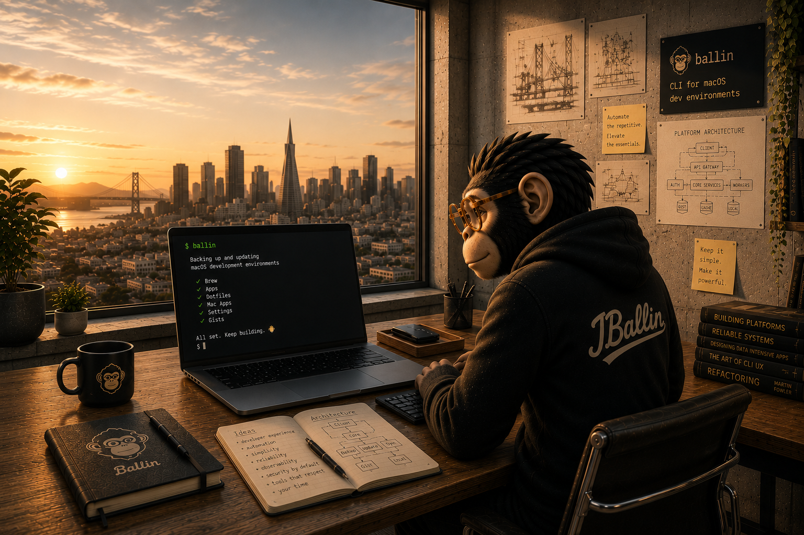

  

I build developer tools that make local development easier to understand, automate, and trust.

My main open-source project is **[Ballin Scripts](https://github.com/JBallin/ballin-scripts)**, a TypeScript CLI for backing up dotfiles and keeping macOS development environments current.

Ballin is built on a simple idea: your development environment should be inspectable, repeatable, and safe to evolve — not a pile of invisible state and fragile rituals.

*Good tools make the next step obvious.*

That's the philosophy I bring to development environments, CLIs, and AI-assisted workflows: less mystery, better context, and more confidence to keep building.

## Focus

- Portable, maintainable development environments
- Predictable CLIs with readable output and inspectable behavior
- Practical automation with secure defaults
- AI-assisted workflows that help engineers understand systems before changing them
